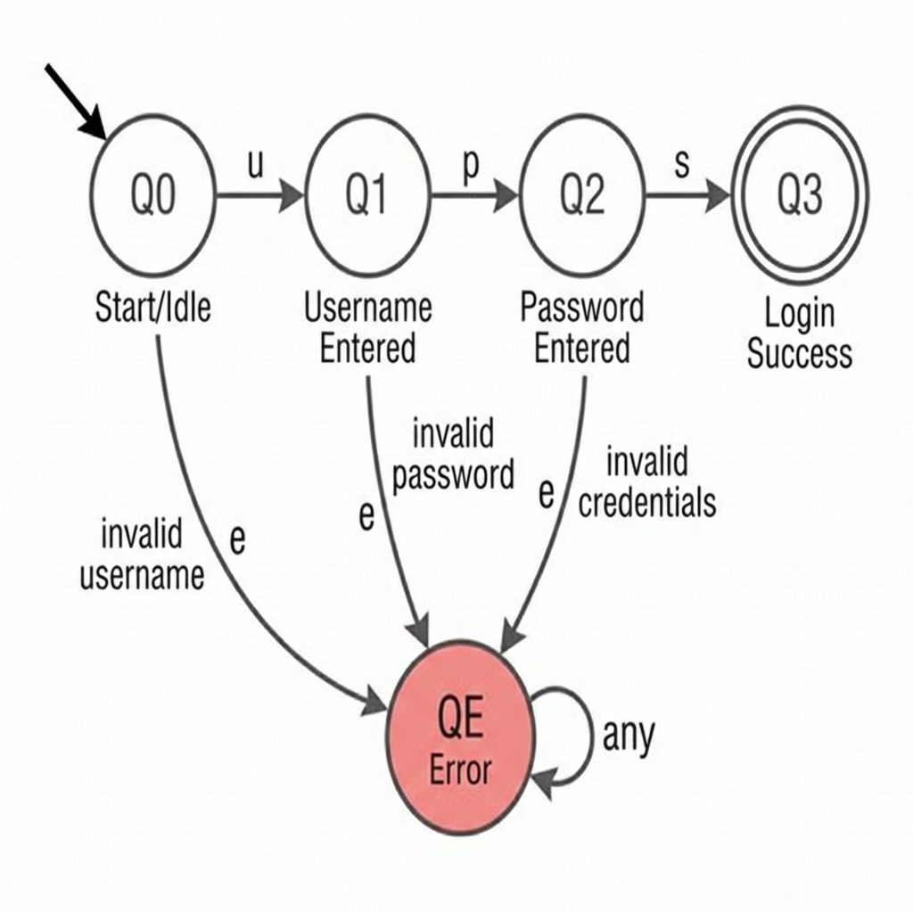
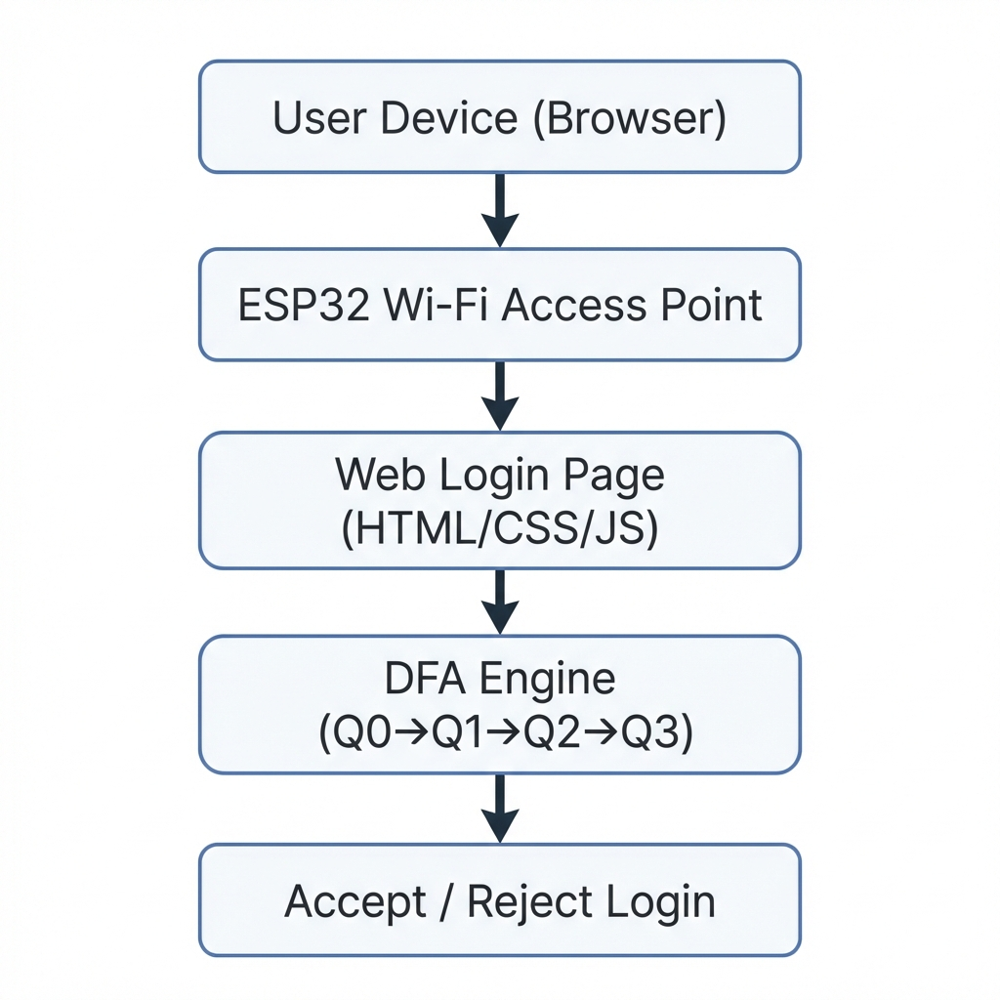

# 📶 Wi-Fi Login Sequence Validator using DFA with ESP32

A Wi-Fi login authentication system where the login process is validated using **Deterministic Finite Automaton (DFA)** rules, running on an **ESP32** microcontroller.

---

## 🎯 Objective

To design and implement a system that validates the **sequence of login inputs** (username → password → submit) using a DFA, instead of directly validating credentials. The DFA ensures inputs follow a strict order and rejects invalid sequences immediately.

---

## 🔬 DFA Design

### Formal Definition
**DFA = (Q, Σ, δ, q₀, F)**

### States (Q)
| State | Meaning |
|-------|---------|
| Q0 | Start / Idle |
| Q1 | Username entered |
| Q2 | Password entered |
| Q3 | Login success ✅ (Final) |
| QE | Error state ❌ (Dead) |

### Input Alphabet (Σ)
| Symbol | Meaning |
|--------|---------|
| `u` | Username entered |
| `p` | Password entered |
| `s` | Submit pressed |
| `x` | Invalid input |

### Transition Table (δ)
| Current | Input | Next |
|---------|-------|------|
| Q0 | u | Q1 |
| Q0 | p, s, x | QE |
| Q1 | p | Q2 |
| Q1 | u, s, x | QE |
| Q2 | s | Q3 |
| Q2 | u, p, x | QE |
| Q3 | any | Q3 |
| QE | any | QE |

### State Diagram


---

## 🏗️ System Architecture

```
User Device (Browser)
        ↓
   ESP32 Wi-Fi AP
        ↓
  Web Login Page
        ↓
 DFA Engine (ESP32)
        ↓
 Accept / Reject Login
```



---

## 🔧 Hardware Requirements

| Component | Purpose |
|-----------|---------|
| ESP32 Dev Board | Main controller |
| USB Cable | Programming |
| Laptop / Mobile | Client device |
| Power Source | USB / Battery |

> No extra sensors needed 👍

---

## 💻 Software Requirements

| Software | Use |
|----------|-----|
| Arduino IDE | Programming ESP32 |
| ESP32 Board Package | Board support |
| WiFi.h | Wi-Fi AP mode |
| ESPAsyncWebServer | Async web server |
| HTML/CSS/JS | Login UI |

---

## 📁 Project Structure

```
WiFi_DFA_Login_ESP32/
│
├── README.md
├── report/
│   ├── abstract.txt
│   ├── problem_statement.txt
│   ├── dfa_design.txt
│   └── conclusion.txt
│
├── src/
│   ├── main.ino          ← ESP32 main sketch
│   ├── dfa.h             ← DFA state enum & declarations
│   ├── dfa.cpp           ← DFA transition logic
│   └── wifi_config.h     ← Wi-Fi AP settings
│
├── web/
│   ├── index.html        ← Login page (standalone)
│   ├── style.css         ← Dark theme stylesheet
│   └── script.js         ← DFA client interaction
│
├── diagrams/
│   ├── dfa_state_diagram.png
│   └── system_architecture.png
│
└── assets/
    └── screenshots/
```

---

## 🚀 How to Run

### 1. Setup Arduino IDE
1. Install [Arduino IDE](https://www.arduino.cc/en/software)
2. Go to **File → Preferences** → Add to Board URLs:
   ```
   https://raw.githubusercontent.com/espressif/arduino-esp32/gh-pages/package_esp32_index.json
   ```
3. Go to **Tools → Board → Boards Manager** → Install **esp32**
4. Install library: **ESPAsyncWebServer** (via Library Manager or GitHub)

### 2. Upload Code
1. Open `src/main.ino` in Arduino IDE
2. Select Board: **ESP32 Dev Module**
3. Select correct COM Port
4. Click **Upload** ⬆️

### 3. Connect & Test
1. On your phone/laptop, connect to Wi-Fi: **`DFA_Login`** (password: `12345678`)
2. Open browser → Navigate to **`http://192.168.4.1`**
3. Enter username → Enter password → Click Login
4. Watch the DFA state transitions in real-time!

---

## 📋 Functional Workflow

1. ESP32 starts as **Wi-Fi Access Point**
2. User connects to ESP32 Wi-Fi network
3. Login page opens in browser
4. User enters:
   - Username (triggers symbol `u`)
   - Password (triggers symbol `p`)
   - Clicks Submit (triggers symbol `s`)
5. Inputs converted to **DFA symbols**
6. **DFA transitions** executed on ESP32
7. Final state checked:
   - **Q3** → ✅ Login Successful
   - **QE** → ❌ Invalid Sequence
8. Result shown on web page with visual state indicator

---

## ✅ Valid vs Invalid Sequences

| Sequence | Trace | Result |
|----------|-------|--------|
| u → p → s | Q0→Q1→Q2→Q3 | ✅ Success |
| p → u → s | Q0→QE | ❌ Rejected |
| u → s | Q0→Q1→QE | ❌ Rejected |
| s | Q0→QE | ❌ Rejected |
| u → p → p | Q0→Q1→Q2→QE | ❌ Rejected |

---

## 📝 Report Sections (for Viva)

- [x] Abstract → `report/abstract.txt`
- [x] Problem Statement → `report/problem_statement.txt`
- [x] DFA Definition & Design → `report/dfa_design.txt`
- [x] State Diagram → `diagrams/dfa_state_diagram.png`
- [x] Transition Table → (in README & dfa_design.txt)
- [x] Hardware & Software Requirements → (in README)
- [x] Algorithm / Workflow → (in README)
- [x] Results → (screenshots in `assets/screenshots/`)
- [x] Applications → (below)
- [x] Conclusion → `report/conclusion.txt`

---

## 🌍 Applications

- Secure login systems
- IoT device authentication
- Smart router access control
- DFA-based protocol validation
- Embedded access control systems

---

## 🔮 Future Enhancements

- ⏱️ Add timeout state for session management
- 🔑 OTP-based DFA for two-factor authentication
- 👥 Multi-user DFA with concurrent sessions
- 📊 Logging authentication attempts
- ☁️ Cloud-based authentication integration

---

## 📜 License

This project is for educational purposes — demonstrating the application of Deterministic Finite Automaton (DFA) theory in embedded IoT systems.
